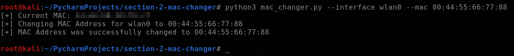

# MAC Address Changer

This script allows you to change the MAC address of a specified network interface on your system. It is written in Python and uses the subprocess module to interact with the operating system's command-line interface.

## Prerequisites
- Python 3.x

## Usage
- To use this script, follow these steps:

  1. Open a terminal or command prompt.
  2. Run the script using the following command:
    ```commandline
    python3 mac_changer.py -i interface -m new_mac_address
  ```
    Replace <interface> with the name of the network interface you want to modify (e.g., wlan0) and <new_mac_address> with the desired MAC address you want to set (e.g., 70:00:00:00:00:08).

## Options
The script supports the following command-line options:

- `-i`, `--interface`: Specifies the network interface to change its MAC address. This option is mandatory.
- `-m`, `--mac`: Specifies the new MAC address to assign to the network interface. This option is mandatory.

## Example
To change the MAC address of the interface `wlan0` to `70:00:00:00:00:08`, run the following command:
```commandline
python3 mac_changer.py -i wlan0 -m 70:00:00:00:00:08
```

## Screenshot


## How It Works
1. The script starts by importing the necessary modules: re for regular expression matching, subprocess for executing shell commands, and OptionParser for parsing command-line options.
2. The get_argument() function is defined to handle command-line arguments. It uses OptionParser to define and parse the options and arguments. If the mandatory options are not provided, an error message is displayed.
3. The change_mac(interface, new_mac) function is defined to change the MAC address of the specified interface. It uses the subprocess.call() function to execute the necessary shell commands to bring the interface down, set the new MAC address, and bring the interface back up. The commented-out lines show an alternative version of the same commands using a formatted string and the shell=True option. However, these commands are considered less secure due to potential security vulnerabilities, so the uncommented lines should be used instead.
4. The get_current_mac(interface) function is defined to retrieve the current MAC address of the specified interface. It uses subprocess.check_output() to execute the ifconfig command and capture its output. The output is then searched using a regular expression pattern to find the MAC address. If found, the MAC address is returned; otherwise, an error message is displayed.
5. The option variable is assigned the result of calling the get_argument() function to retrieve the command-line options.
6. The current MAC address of the specified interface is obtained by calling the get_current_mac(interface) function.
7. The current MAC address is displayed.
8. The change_mac(interface, new_mac) function is called to change the MAC address of the specified interface to the new MAC address provided in the command-line options.
9. The current MAC address of the specified interface is obtained again.
10. If the current MAC address matches the new MAC address, a success message is displayed; otherwise, an error message is displayed.

## Notes
- This script uses the `subprocess` module to execute shell commands. Make sure to run it with appropriate permissions or as an administrator, depending on your operating system and network configuration.
- Changing the MAC address of a network interface may have legal and ethical implications. Ensure that you have proper authorization and adhere to applicable laws and regulations.
- This script is provided as-is without any warranty. Use it at your own risk.
